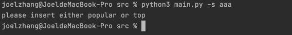
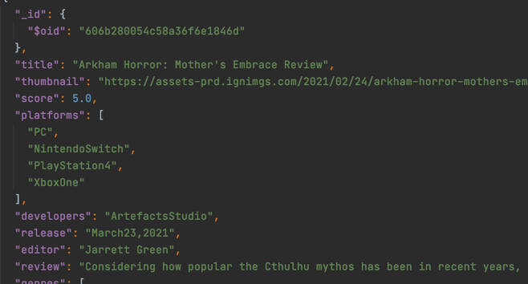
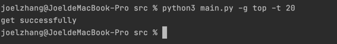
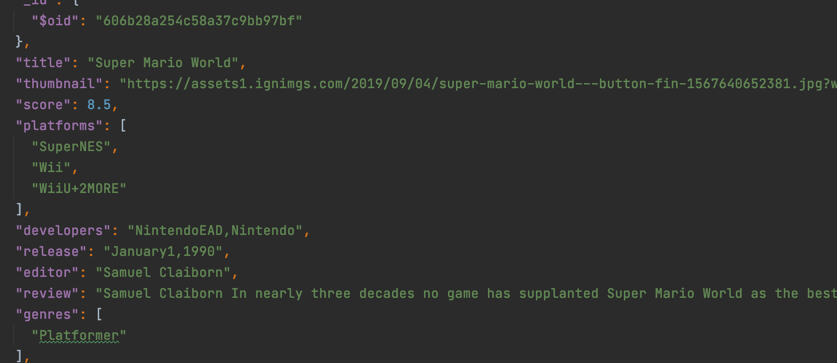
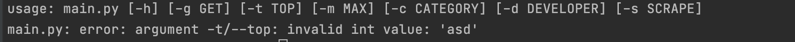
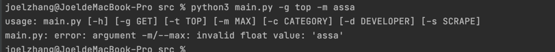
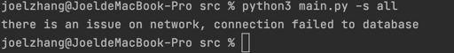

# Manual Test Plan

###  Week 1 for scraping functionality and database

### Pre-Test
My environment:

Python 3.8

pymongo for mongoDB

urllib, webDriver, and selenium for web scraping

python unittest for unittest

#### TC.1 The normal scrape cli

Above command running scrape with -s and an invalid argument, which will 
lead to a warning telling you to insert correctly and also shut down the application

The correct way of scraping popular games from ign.com
```commandline
python3 main.py -s popular
```
Running web driver once command successfully recognized


#### TC.2 The normal get cli from database
```commandline
python3 main.py -g top
python3 main.py -g popular
```
the result should be


and creating a corresponding json file in the directory


This is the example for the popular game information, top100
is the similar way to extract

#### TC.3 The rank filter 

When you run command line
```commandline
python3 main.py -t 10
```
this command line should return you the top 10 rated games in the 
collection.
a successful message

and json file

The rank is from top to bottom


#### TC.4 the invalid input for filter
The argparser lib handles the arguments parsing. For example, the type
of -t argument has to be integer
otherwise:


This message will pop out.

also invalid input for max attribute

This input has to be type of number

#### TC.5 network failure exception
The cli will handle the failure of networking and sending corresponding warning information
in the terminal and ends the application
