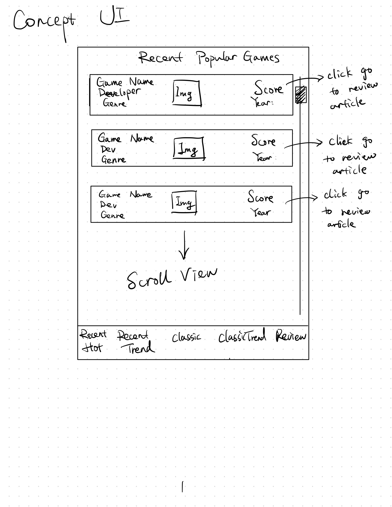
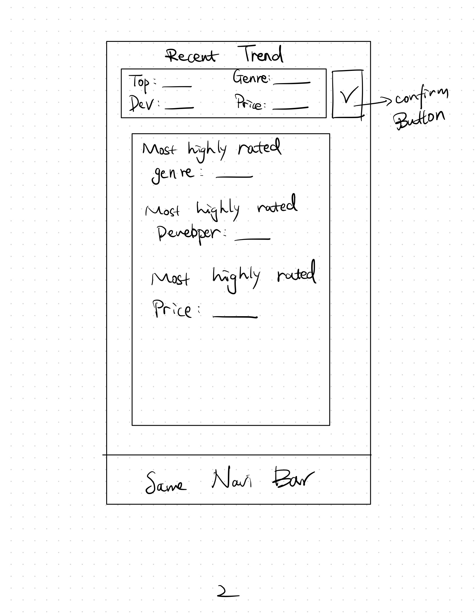
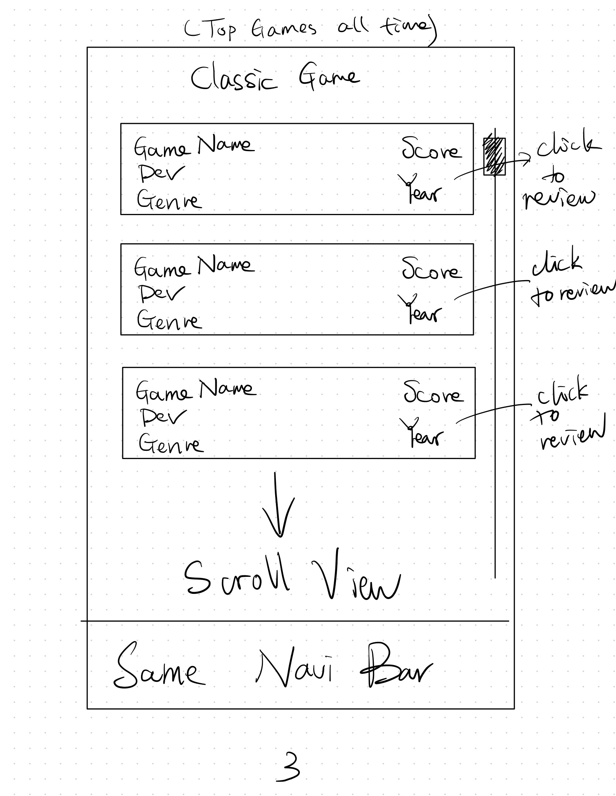
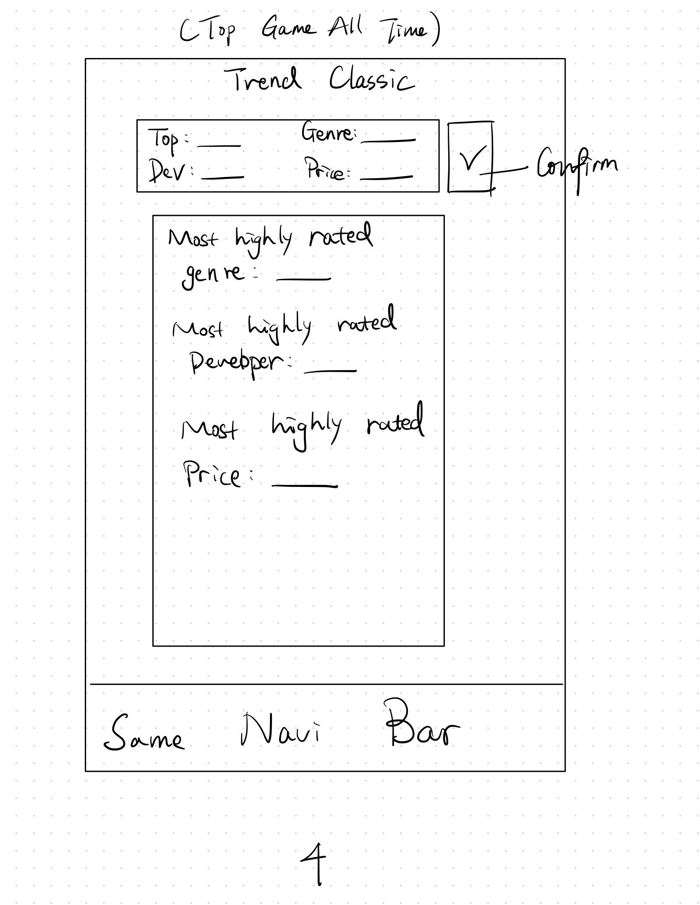
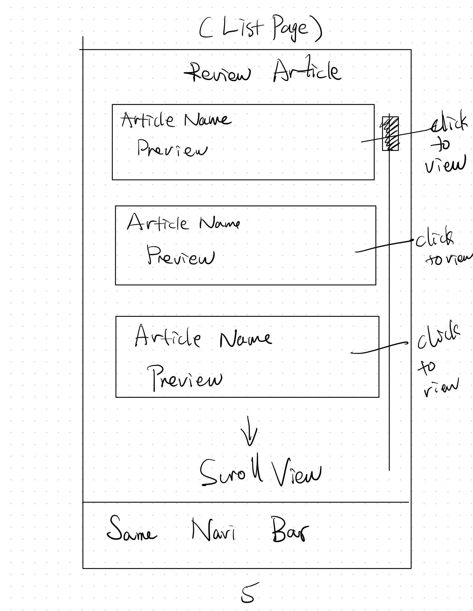
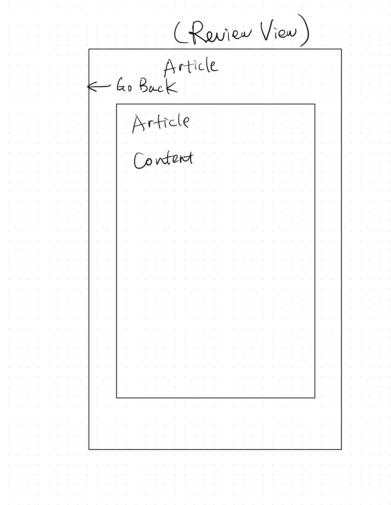

# A Mobile App Game Information Project
Jiaming Zhang (jz32) | Moderator: Bailey Tincher (tincher2)

This is a mobile app about a project for CS242

## "Popular Games"
### Project Purpose
I am thinking of building a mobile app that can help people, both customers and developers to see the mainstream of current video games industry.

### Project Motivation
I am very interested in both video game industry and software developing. I always talked to my game design mentor on what’s the industry trending now. 

## Technical Specification
- Platform: Cross-platform app (React Native)
- Programming Languages: JavaScript (Python for Flask should backend required)
- Stylistic Conventions: Airbnb JavaScript Style Guide
- SDK: Facebook SDK for React Native
- Databse: MongoDB
- IDE: Visual Studio Code
- Tools/Interfaces: Mobile devices
- Target Audience: Game developer/audience interested in game industry

## Functional Specification
### Features
- Displaying IGN's recent high score games' information(
  Including title, genre, developer studio, development scale, etc
)
- Displaying recent the most favorable game genre/scale based on the information above.
- Displaying the most favorable game genre/other information of all the time.(or set a filter on time since)
- Displaying review article of game from IGN

### Scope of the project
- There is no intension to build account system for the project, meaning not storaging preference setting and browsing data.
- I hope I can add account and forum/post system in the future to enable users to communicate and comment.
- Scope is to realize the features and display them in mobile app.

## Brief Timeline
- Week 1: Build a scraper to scrape IGN to gather game's information and review article information.
- Week 2: Build a RESTful API to manipulate data in week 1
- Week 3: Build a mobile app with recent top game information and trending/review article for those game along with filter.
- Week 4: Build top game information and review of all time.

## Rubrics
### Week 1
| Category  | Total Score Allocated | Detailed Rubrics                                                            |
|-----------|:---------:|-------------------------------------------------------------------------------|
|  Scrapinging games information |  6  |  0: Didn't implement anything   2: implemented top recent game basic function    3: implemented 1 & related review   4: implemented 1 & 2 & all time game information   6: implemented 1 & 2 & 3 & game related review(all)
|  Connecting to Database |  5  |  0: Didn't implement anything   2: implemented get from database   4: implemented update database and insert database   5: completed function
|  Commandline interface |  4  |  0: Didn't implement anything   1: display recent game   2: display all time top game  4: completed function d |
|  Unit Test |  5  |  +0.5 per unittest
|  Manual Test |  5  |  +1 per test

### Week 2
| Category  | Total Score Allocated | Detailed Rubrics                                                            |
|-----------|:---------:|-------------------------------------------------------------------------------|
| API |  8  |  0 points: Lacks any API  GET +0.5 pt for each of two routes that supports getting either a single recent top game or all time game +0.5 pt for supporting getting either a single recent top game or all time game related view article POST +1 pt for each of four routes that supports adding new game(recent or all time) +1 pt for corresponding review article  PUT +0.5 pt per route DETELE: +0.5 pt per route -0.5 pt for each wrong return types (200, 400, 415, 404) for each route -0.5 pt for not reporting errors for each route -0.5 pt for not returning valid JSON for each route, including static contents like HTML
|  Filter |  7  |  0: Didn't implement anything   +0.5 per filter keyword supported
|  Unit Test |  10  |  +0.5 per unittest

### Week 3
| Category  | Total Score Allocated | Detailed Rubrics                                                            |
|-----------|:---------:|-------------------------------------------------------------------------------|
|  View Layer |  6  |  0: Didn't implement anything  +1 pt: game stat view are implemented  +1 pt: game trend view are implemented +1 pt: Navigation between screens +1 pt: Clean separation between model and view +1 pt: Loading views for both game view and trend view +1 pt: Error handling view for both views
|  Model Interface |  4  |  +2 pt for each recent game/all time game parsing
|  Filter |  2  |  0: Didn't implement anything   +1 pt for a keyword filtering
|  Fetching data from API |  3  |  0: Didn't implement anything   +1 for each game/trend fetch
|  Unit Test |  5  |  +0.5 per unittest
|  Manual Test |  5  |  +1 per test

### Week 4
| Category  | Total Score Allocated | Detailed Rubrics                                                            |
|-----------|:---------:|-------------------------------------------------------------------------------|
|  View Layer |  6  |  0: Didn't implement anything  +1 pt: recent game review view are implemented  +1 pt: all time game review view are implemented +1 pt: Navigation between screens +1 pt: Clean separation between model and view +1 pt: Loading views for both views +1 pt: Error handling view for both views
|  Model Interface |  4  |  +2 pt for each recent game/all time game reviewe article parsing
|  Filter |  2  |  0: Didn't implement anything   +1 pt for a keyword filtering update
|  Fetching data from API |  3  |  0: Didn't implement anything   +1 for each review fetch
|  Unit Test |  5  |  +0.5 per unittest
|  Manual Test |  5  |  +1 per test

### Proposal Sketch

